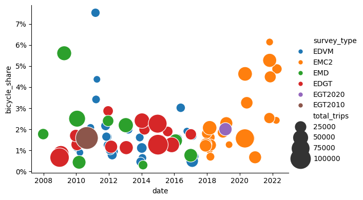
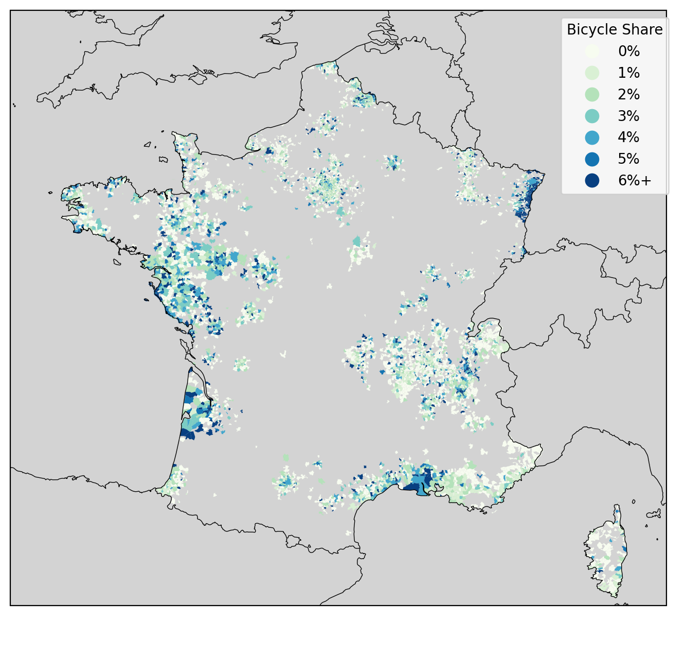

# MobiSurvStd

## Introduction

MobiSurvStd (Mobility Survey Standardizer) is an easy-to-use Python command line interface to convert many French mobility surveys
(EMC², EGT, EMP, etc.) to a unique standardized and clean format.

---

## Mobility Surveys in France

In France, despite recent efforts by CEREMA to create a standard format for mobility surveys – with
the EMC² surveys – various formats co-exist:

- [**EMC²**](https://www.cerema.fr/fr/activites/mobilites/connaissance-modelisation-evaluation-mobilite/enquetes-mobilite-emc2)
  (Enquête mobilité certifiée CEREMA): mobility surveys for many French territories (since 2018);
- [**EGT H2020**](https://omnil.fr/actualites/les-resultats-de-la-derniere-enquete-globale-transport)
  (Enquête Globale Transport, Île-de-France Mobilités): mobility survey for Île-de-France (2018–2020;
  incomplete due to COVID-19);
- [**EMP**](https://www.statistiques.developpement-durable.gouv.fr/resultats-detailles-de-lenquete-mobilite-des-personnes-de-2019)
  (Enquête mobilité des personnes, SDES): national mobility survey (2019).
- [**EMG**](https://www.institutparisregion.fr/mobilite-et-transports/deplacements/enquete-regionale-sur-la-mobilite-des-franciliens/)
  (Enquête Mobilité par GPS, Institut Paris Région): mobility survey for Île-de-France (2022-2023)
  with individuals tracked over several days through GPS.

Also surveys based on previous formats are still in use today:

- **EDVM** (Enquêtes Déplacements Villes Moyennes, CEREMA): mobility surveys for medium-size cities
  (until 2018);
- **EDGT** (Enquêtes Déplacements Grands Territoires, CEREMA): mobility surveys for periphery areas
  (until 2018);
- **EMD** (Enquêtes Ménages Déplacements, CEREMA): other mobility surveys from CEREMA (until 2018);
- [**EGT 2010**](https://omnil.fr/egt-2010) (Enquête Globale Transport, Île-de-France Mobilités):
  previous version of the Île-de-France mobility survey;
- [**ENTD**](https://www.statistiques.developpement-durable.gouv.fr/enquete-nationale-transports-et-deplacements-entd-2008)
  (Enquête nationale transports et déplacements, SDES): former national mobility survey (2008).

---

## Why MobiSurvStd?

The existing formats all have the same drawbacks:

- Data are sorted in CSV files which are not always straightforward to read (Which separator?
  Which encoding? What are the variable datatypes?).
- Variable names and modalities are not always clear (e.g., in the EMC² format, variable "P2"
  represents the gender of the person, with modality 1 for a man and 2 for a woman).
- Joining two datasets is hard and not well documented (e.g., in the EMC² format, to join the
  persons with their household, the variables to use are "METH", "ZFM" and "ECH" for the households
  and "DMET", "ZFD" and "ECH" for the persons).

Additionally, when working with different territories / periods, it is often necessary to write a
similar code multiple times due to the existence of different formats.

MobiSurvStd solves all these issues by being able to convert all survey formats to a [well-defined
Parquet format](format/index.html).

See [this example](problem-example.html) to understand how MobiSurvStd can simplify your workflow.

---

## Installation

Install the library with

```bash
pip install mobisurvstd
```

---

## Getting Started

Download the
[EMP 2019 survey](https://www.statistiques.developpement-durable.gouv.fr/resultats-detailles-de-lenquete-mobilite-des-personnes-de-2019)
_(Données individuelles anonymisées (fichiers au format CSV))_, then run the following command:

```bash
python -m mobisurvstd emp_2019_donnees_individuelles_anonymisees_novembre2024.zip standardized_emp2019
```

It will standardize the EMP 2019 survey and save the resulting Parquet files in the
`standardized_emp2019` directory.
These Parquet files can then be analyzed using e.g., [polars](https://pola.rs/) or
[pandas](https://pandas.pydata.org) in Python or [arrow](https://arrow.apache.org/docs/r/) in R.

**Note:** During standardization, MobiSurvStd may issue warnings when certain variable guarantees
are not initially satisfied but are automatically fixed.
These warnings can usually be safely ignored, unless they pertain to a large number of observations.

A detailed definition of the Parquet format used by MobiSurvStd is available
[here](format/index.html).

You can also standardize surveys programmatically in Python with the `standardize` function:

```python
import mobisurvstd
mobisurvstd.standardize(
    "emp_2019_donnees_individuelles_anonymisees_novembre2024.zip",
    "standardized_emp2019",
)
```

For more, check the [User Guide](howto.html).

**Citing MobiSurvStd**

If you use MobiSurvStd in a publication or project, please include the following attribution:
"This work used the MobiSurvStd library developed by Lucas Javaudin, available at
[https://github.com/MobiSurvStd/MobiSurvStd]()".

---

## Case Study: Bicycle Use

The following graph represents the share of bicycle trips for EMC², EDGT, EDVM, EMD, and EGT
surveys.
The circle colors represent the average number of bicycles in the surveyed households.
The circle sizes represent the expected number of trips in the surveyed area.

The graph has been generated from the code in
[analyses/bicycle_shares.py](https://github.com/MobiSurvStd/MobiSurvStd/blob/main/analyses/bicycle_shares.py).



The following map represents the share of bicycle trips within INSEE municipalities.
Only municipalities with more than 30 surveyed trips are shown.

The map has been generated from the code in
[analyses/bicycle_shares_by_insee.py](https://github.com/MobiSurvStd/MobiSurvStd/blob/main/analyses/bicycle_shares_by_insee.py).



---

## Supported Surveys

Currently, MobiSurvStd supports the following survey types:

- `emp2019`
- `emc2`
- `egt2020`
- `egt2010`
- `edgt` (including the [https://www.data.gouv.fr/datasets/enquete-deplacements-2015-en-loire-atlantique](open-data version of Nantes 2015))
- `edvm`
- `emd`

See [Survey Types](surveys.html) for more.

Other survey types that are planned to be integrated are: `entd`, `emg`.
If you know another survey format that could be integrated, feel free to open an issue on GitHub.

MobiSurvStd covers only French mobility survey formats.
If other countries have similar survey formats, they might be easily integrated into MobiSurvStd (or
a variant of it).

---

## Legal Notice

<span style="color:red">
⚠️ <strong>MobiSurvStd does not anonymize the data.</strong>
If you are working with confidential datasets (e.g., EMC² or EGT surveys), you must apply the same
confidentiality rules to the standardized data as to the original data.
In particular, <strong>you must not share the standardized data</strong> if your confidentiality
agreement prohibits sharing the original data.
</span>

---

## Contributing

If you think you found a bug, if you have a suggestion, or if you want to integrate a new format,
feel free to open an issue on GitHub or to create a Pull Request.
